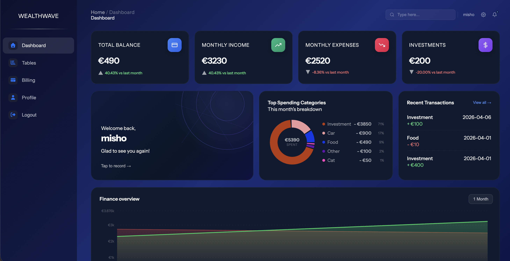
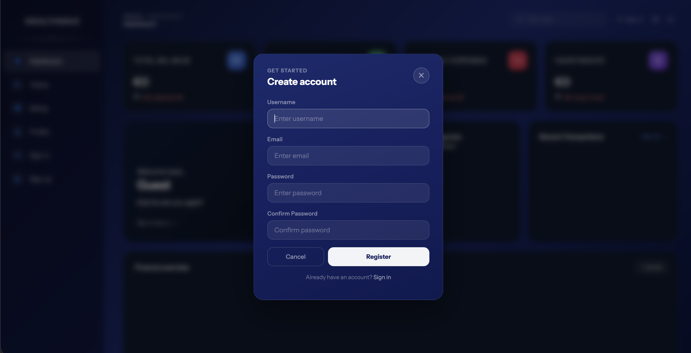
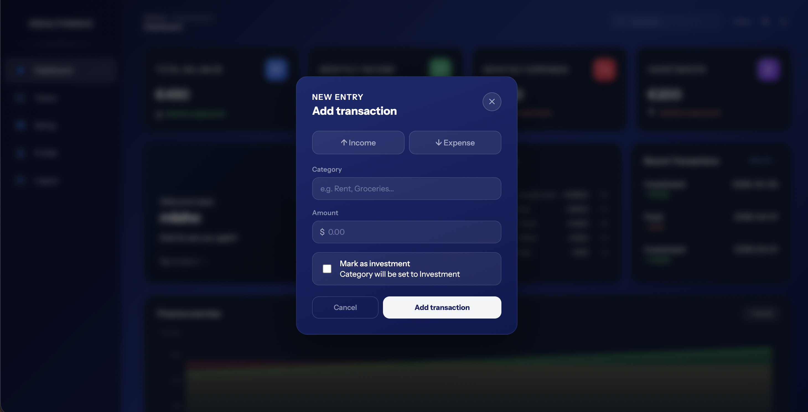
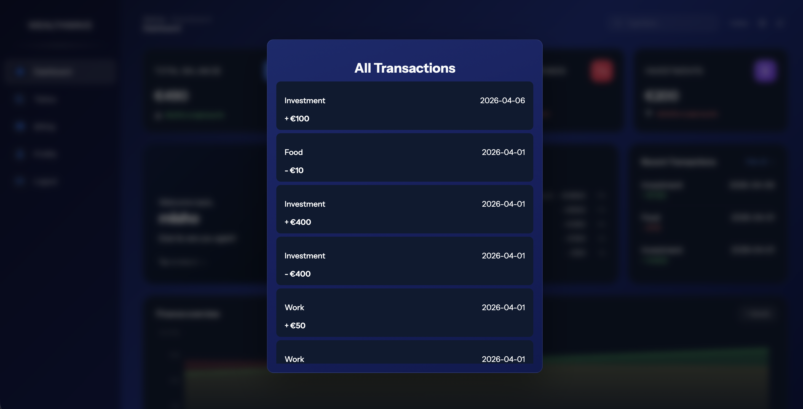

# 💸 Finance Dashboard – Personal Finance Tracker

A modern React-based web application that helps you manage your personal finances with ease. Track your income and expenses, visualize your spending habits with charts, and stay on top of your monthly budget with a clean and intuitive interface.

## ✨ Features

## 🔐 User Authentication

Secure login and registration system using JWT sessions to protect user data and manage access.

## 💰 Income & Expense Tracking

Add and manage transactions by categorizing them as income or expenses. Stay organized and keep full control of your financial activity.

## 📊 Interactive Charts

Visualize your financial data with dynamic charts to better understand your spending patterns and income trends.

## 📅 Monthly Tracking

Monitor your monthly income and expenses to get a clear overview of your financial health.

## 📖 Usage
Sign up or log in to access your dashboard.
Add transactions as income or expense.
Track your spending through charts and summaries.
Monitor monthly activity to improve budgeting.
## 🖥️ Screenshots

## 🔗 Repositories
- Backend — https://github.com/panayotovv/finance-dashboard-frontend
- Frontend — https://github.com/panayotovv/finance-dashboard-backend

📄 License
This project is licensed under the MIT License.
